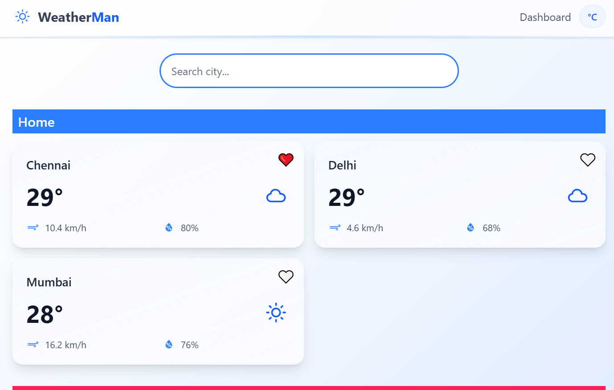

# 🌤️ WeatherMAN



Welcome to **Weather Analytics Dashboard**! ⚡ Track real-time weather with beautiful charts 📊 and detailed insights 🌡️.  
Powered by **React** & **Redux Toolkit**, supporting **hourly, daily, and current weather** ⚡.  
Dynamic **city search** & **location-based forecasts** 📍 with metrics like wind 💨, humidity 💧, pressure, and UV 🌞.  
Fast **caching** & **rate-limiting** ⏱️ for smooth API usage, fully **responsive** on desktop 💻 & mobile 📱.  
Interactive **charts** 🎨 and easy **deployment** 🚀 on Vercel or any static hosting.

## ⚙️ Features

- 🌍 **Global city support** – check weather anywhere in the world.  
- ⏰ **Real-time updates** – stay updated with the latest weather.  
- 📈 **Hourly & daily charts** – visually track temperature, wind, and precipitation.  
- 🧩 **Component-based UI** – reusable cards, charts, and widgets.  
- 🖌️ **Clean design** – easy to read with proper sizing & spacing.  
- 💾 **Caching mechanism** – faster load times for repeated searches.  
- 🔒 **Error handling** – shows user-friendly messages for API issues.  
- 🌐 **Responsive layout** – works perfectly on mobile, tablet, and desktop.  
- 🚦 **Rate-limiting** – avoids API overloading and ensures smooth performance.  


## Tech Stack 📑

- Frontend: React.js, Redux, Tailwind, Typescript
- Weather API: Open-Meteo
- Charts: ReCharts
- Deployment: Vercel


---

# How to Run Locally 🏃‍♂️

## 1. Clone the repository

```bash
git clone https://github.com/santhoshpandi/WeatherMan.git
cd WeatherMan
```

## 2. Create `.env` file:

```.env
VITE_GEO_URL = open-meteo-geo-url
VITE_WEATHER_URL = open-meteo-weather-url
```

## 3. For Starting the App

```bash
npm install
npm run dev
```
Frontend available at [PORT: 5173](http://localhost:5173/)

---

Coded by 💖 Santhosh Pandi